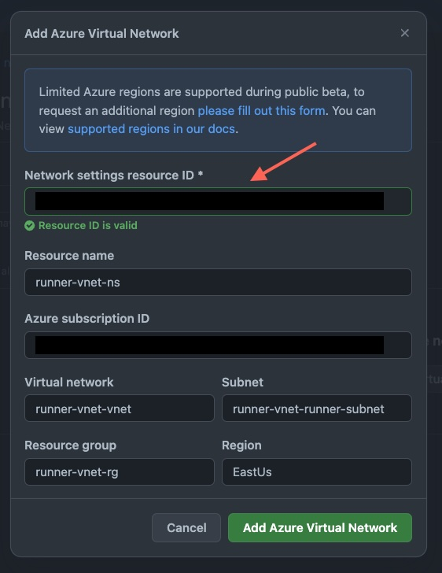

# github-runner-vnet

Terraform modules that configure and maintain the infrastructure needed to run GitHub-Hosted Action Runners in a [private network](https://docs.github.com/en/enterprise-cloud@latest/admin/configuration/configuring-private-networking-for-hosted-compute-products/configuring-private-networking-for-github-hosted-runners).

## Quick Start

1. Before running, review [pre-requisites](https://docs.github.com/en/enterprise-cloud@latest/admin/configuration/configuring-private-networking-for-hosted-compute-products/configuring-private-networking-for-github-hosted-runners#prerequisites) from the documentation to ensure your environment is properly configured.
1. The [Azure CLI](https://learn.microsoft.com/en-us/cli/azure/) must be installed and on the system path, logged in with the identity that you want these resources created under, and Azure Subscription configured.
1. The `GitHub.Network` resource provider must be registered in the Azure Subscription. The Terraform modules contain HCL to register this provider, but it is commented out since you may not want this managed by Terraform. See the above GitHub documentation for a sample AZ CLI command to register the provider.

This repo contains two Terraform modules:

* [nsg](./modules/nsg/) module: Uses a [Network Security Group (NSG)](https://learn.microsoft.com/en-us/azure/virtual-network/network-security-groups-overview) to manage the network security of the VNet.

```hcl
module "github_runner_vnet" {
  # Use the nsg version
  source = "github.com/garnertb/github-runner-vnet/nsg"

  # The resources use this base_name as a name prefix, e.g. ${base_name}-rg for the resource group
  base_name = "vnet-test"
  
  # Retrieve through the GitHub API (see GitHub docs for instructions)
  github_enterprise_id = "12345"
}
```

* [firewall](./modules/firewall/) module: Uses an [Azure Firewall](https://learn.microsoft.com/en-us/azure/firewall/overview) to manage the network security of the VNet.

<details><summary>Terraform config for the firewall</summary>

Provision and configure the infrastructure in Terraform by calling this module:

```hcl
module "github_runner_vnet" {
  # Use the firewall version
  source = "github.com/garnertb/github-runner-vnet/firewall"

  # The resources use this base_name as a name prefix, e.g. ${base_name}-rg for the resource group
  base_name = "vnet-test"
  
  # Retrieve through the GitHub API (see GitHub docs for instructions)
  github_enterprise_id = "12345"
}
```

</details>

The output of these modules is the Resource ID for the `GitHub.Network/networkSettings` resource. Paste this ID into the github.com UI for configuring the Azure Virtual Network.

